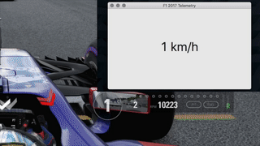

# F1 2017 Telemetry 🏎

The Codemasters F1 series of games let you get some [game data using UDP](http://forums.codemasters.com/discussion/53139/f1-2017-d-box-and-udp-output-specification).

This is a dumb little demo macOS app, written in Swift, that connects to the game using UDP and displays the speed of the driver’s car.

